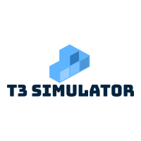

# T432_GOJ19_T3_A : T3 Simulator

# Présentation
Bienvenue sur le git de T3 Simulator !
Notre projet a pour but de développer un jeu sérieux visant un utilisateur lambda, qui sera chargé de simuler la gestion d’un projet, en assignant des tâches à une équipe de personnes dans le but de terminer le projet à 100% avant une deadline imposée. 
Pour y parvenir, le joueur devra enfiler les différentes casquettes d’un chef de projet et apprendre à construire une équipe reliant affinité, productivité et cohésion. Il devra anticiper les risques d’un projet, apprendre à estimer des charges et durées, et comprendre la complexité de la gestion d’un projet. 

Le jeu est stocké localement sur l’ordinateur via un installateur, et disponible exclusivement sur Windows via le partage des développeurs. Il n’y aura donc pas d’hébergement en ligne, ni de serveurs. Le simulateur est développé en C# sur le logiciel Visual Studio en environnement .NET. 
Il dispose d’une Interface Homme-Machine, simple, intuitive et ergonomique. 

[Cahier des charges](https://docs.google.com/document/d/1Wt1TN2uy75v-5iO5i8XkizberEv1joOm_bvyGyg5HoU/edit)

[Lien de téléchargement de l'application](https://git.unistra.fr/projet-t3/myt3/blob/master/Menu/Setup/Setup%20T3.msi)

# Objectifs pédagogiques

Prendre connaissance du projet, savoir déterminer les objectifs du projet. 

Connaître son groupe de projet
ses affinités avec le projet et entre eux
connaître leur point fort et point faible

chaque tâche est définie par :
- une difficulté
- un temps de réalisation
- rattachée à un objectif
- un niveau de connaissance

Prendre conscience des phases d’un projet :
- Spécification
- Conception
- Réalisation
- Recette
- Livraison

Savoir utiliser les informations à bon escient :
- gestion du temps de travail
- choix à prendre en fonction de l'état de l’équipe.

**Savoir gérer des tâches** 
Si la tâche plaît à la personne selon ses compétences, alors la motivation de cette personne augmente et sa fatigue augmente moins vite.
Au contraire si la tâche lui déplait, augmentation du stress, de fatigue, baisse de motivation, d’efficacité et risque de dépression.

En fonction de la capacité de son groupe dans une tâche :
- Un membre du projet a beaucoup d'affinité avec un autre membre ? Sa motivation augmente. 
- Au contraire en cas d’affinité négative, vous devinez que sa motivation en sera impactée. 

Attention ! Il y aura de multiples aléas durant votre projet, restez prudent !

# Synopsis du jeu

Vous avez pour mission de mener un projet à bien avant une certaine date, cependant vous ne connaissez ni votre équipe de projet... ni même rien sur le projet.
Il vous faudra apprendre à connaître votre équipe et reconnaître ce qu'il faut faire pour réussir ce projet. 
Mais votre chemin sera semé d'embûches : équipiers malades, nouvelles demandes du client, stress et fatigue trop importants...
Saurez-vous compléter le projet à temps malgré tout ?

# Installation du jeu

Pour installer le jeu vous devez installer [l'executable]depuis gitlab.
[Lien de téléchargement de l'application](https://git.unistra.fr/projet-t3/myt3/blob/master/Menu/Setup/Setup%20T3.msi)

## Executer le jeu

Il suffit de double cliquer sur l'executable que vous venez de télécharger. (Voir image)

### Déroulement d'une partie

Vous commencerez la partie sans aucunes informations, car vous venez d'être assigné à un projet et une nouvelle équipe. 
Vous ne pourrez rien faire sans faire une première réunion : dans celle-ci vous aurez plusieurs choix de thématique mais vous êtes limité à 3 thèmes (par réunion) sur une totalité de 8 thèmes.
Les informations  sur votre équipe et le projet seront révélées peu à peu au fur et à mesure de vos réunions.

Une fois le cahier des charges établi lors d'une réunion, vous pourrez commencer à travailler sur le projet.
Pour cela il suffit de faire glisser une fonctionnalité du projet dans un horaire disponible d'un membre de l'équipe de projet.
Celui-ci avancera plus ou moins vite en fonction de multiples paramètres : ses qualités, défauts, points forts, points faibles, sa compétence et même sa relation avec d'autres membres de l'équipe qui travaillent sur la même fonctionnalité impacteront l'efficacité et la vitesse à laquelle il travaillera.
Votre choix de fonctionnalité à faire sera limité chaque tours : en effet ils vous sera nécessaire de finir un ensemble de fonctionnalité liées à une phase précise du projet, avant de pouvoir passer à d'autres fonctionnalités liées à la prochaine phase.

Le stress et la fatigue de chaque membre du groupe augmentera au fur et à mesure de la partie, plus ou moins vite en fonction de vos décisions.
Puis fatalement vous aurez besoin de mettre au repos des membres de votre équipe pour éviter qu'ils ne deviennent complètement inneficaces !

Aléatoirement vous aurez également une nouvelle demande client

### La fin de partie

Enfin, vous aurez (peut-être) réussi à atteindre la dernière phase du projet : la livraison !
Dans ce cas, bravo, vous avez réussi à terminer le projet à temps. Vous arriverez donc sur l'écran de fin.

Dans le cas où vous n'ayez pas réussi à terminer le projet dans le nombre de tours impartis vous serez renvoyés sur l'écran de fin également... mais vous aurez perdu ! 

# Technologies utilisés

Le jeu a entièrement été développé sur [Visual Studio](https://visualstudio.microsoft.com) en `C#`.

# Documentation

Telecharger le dossier complet depuis git le dézipper.

et ouvrir le fichier Documentation.lnk situé içi : Documentation/Documentation.lnk

### Collaborateurs 

*  [Valentin HEIT](https://git.unistra.fr/vheit)
*  [Mathieu CISSE](https://git.unistra.fr/mathieu.cisse)
*  [Aymeric AZIDROU](https://git.unistra.fr/azidrou)
*  [Samir KAMAR](https://git.unistra.fr/skamar)

 
